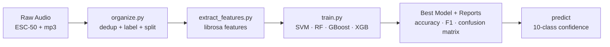

<div align="center">

# 🔊 SonicSentinel AI

### *AcousticX Intelligence — Real-time Sound-Event Detection*


<br/>


<br/>

`Category: NextWave AI and ML` &nbsp;•&nbsp; `Theme: AcousticX Intelligence`

</div>

---

## 🎯 What is SonicSentinel?

SonicSentinel AI listens to uploaded audio and live microphone input, then automatically
detects critical sound events — **machinery faults, glass breaking, alarms, gunshots,
panic screams, aggression, calls for help** and more — so responders never miss what matters.

This repository contains the **Python machine-learning pipeline**: data organisation,
audio preprocessing, acoustic feature extraction, and multi-model training with full
evaluation reports.

---

## 🧩 The 10 Mandatory Sound Classes

<div align="center">

| 🛠️ Machinery Fault | 🪟 Glass Breaking | 🚨 Alarm / Siren | 📯 Vehicle Horn | 🐾 Animal Sound |
|:---:|:---:|:---:|:---:|:---:|
| **🔫 Gunshot** | **😱 Panic Scream** | **🗣️ Person Asking for Help** | **💢 Aggression** | **🌫️ Background Noise** |

</div>

---

## 🗂️ Project Structure

```
SonicSentinel/
├── config/
│   └── config.yaml            # central config (paths, audio, features, models, augmentation)
├── src/                       # ML pipeline
│   ├── sonic/                 # core package
│   │   ├── config.py          # config loader + path resolver
│   │   ├── labels.py          # ESC-50 -> SRS class mapping
│   │   ├── preprocessing.py   # load / mono / resample / trim / normalise / pad
│   │   ├── features.py        # MFCC, mel, chroma, ZCR, RMS, spectral features
│   │   └── augmentation.py    # noise / shift / pitch / stretch / reverb / distance / device
│   ├── organize.py            # build dataset + metadata (dedup + stratified split)
│   ├── extract_features.py    # extract features (+ train-only augmentation) to .npz
│   ├── train.py               # train Python model + independent GTM-substitute; reports
│   └── predict.py             # CLI single-clip prediction
├── webapp/                    # Flask web application
│   ├── app.py                 # routes, auth, real inference, alerts, DB
│   ├── services/              # database, audio_io, visuals, inference, alerts, categories
│   ├── templates/             # Jinja pages (dashboard, live, analysis, reviews, reports…)
│   └── static/                # CSS + JS (wired to the real API)
├── alert_rules/
│   └── alert_rules.json       # configurable alert rules (severity, thresholds, actions)
├── tests/                     # pytest suite (preprocessing, features, augmentation, alerts)
├── sample_audio/              # one demo clip per available class
├── documentation/             # INSTALL guide + SRS document
├── esc50.csv                  # ESC-50 target -> category reference
├── start_sonicsentinel.bat    # double-click to launch the web app
├── train_models.bat           # double-click to (re)train the models
├── requirements.txt · AI_USAGE.md · LICENSE · README.md
```

## ⚡ One-Click Start (Windows)

Just **double-click** a `.bat` file — no terminal needed:

| File | What it does |
|:---|:---|
| **`start_sonicsentinel.bat`** | Launches the web app and opens `http://127.0.0.1:5000` in your browser. Auto-creates a virtual environment + installs dependencies on first run. |
| **`train_models.bat`** | Runs the full pipeline (organize → features → train). Needed once, or after adding new audio to `Dataset/`. |

> 🔒 The raw audio dataset and generated model artefacts are intentionally **not** committed
> (see `.gitignore`). They are kept locally or in Git LFS / object storage because of size.

---

## 🔬 The Pipeline



**Acoustic features extracted** (SRS Step 6): MFCC + delta, Mel spectrogram (dB),
Chroma, Zero-crossing rate, RMS energy, Spectral centroid / bandwidth / roll-off.

**Models compared** (SRS Step 7 — at least three): Support Vector Machine,
Random Forest, Gradient Boosting, XGBoost. The best model is selected on macro-F1.

---

## 🚀 Quick Start

```powershell
# 1. Create and activate a virtual environment
python -m venv .venv
.\.venv\Scripts\Activate.ps1

# 2. Install dependencies
python -m pip install -r requirements.txt

# 3. Place raw audio under Dataset/  (ESC-50 wavs + your mp3 category folders)

# 4. Train the models
python src/organize.py            # build dataset + metadata (dedup + stratified split)
python src/extract_features.py    # extract features (+ train-only augmentation)
python src/train.py               # train Python model + independent GTM-substitute

# 5. Launch the web app
python webapp/app.py              # http://localhost:5000
```

Demo accounts (created on first run): `admin@sonicsentinel.ai` / `admin`,
`operator@sonicsentinel.ai` / `operator`, `reviewer@sonicsentinel.ai` / `reviewer`.

All paths, audio settings, feature parameters, augmentation, the model list, and
**alert rules** (`alert_rules/alert_rules.json`) are configurable without code changes.

> **Note on storage:** heavy generated artefacts (dataset copies, features, models,
> uploads, database) are written under `paths.output_root` in `config/config.yaml`.
> Point it at any drive with free space.

## 📖 How to use each feature (SRS execution guide)

| Task | Where / how |
|---|---|
| **Registration & login** | `/register` to create an account (pick a role); `/login` or a demo button. |
| **Audio upload** | Audio Analysis → drag a clip or browse; single or batch. |
| **Audio preview** | The upload page shows an inline player (play/pause/seek/volume). |
| **Live microphone monitoring** | Live Monitor → allow mic → Start; ~2.5s windows classified continuously. |
| **Metadata viewing** | Shown after upload: duration, sample rate, channels, size, bit depth. |
| **Waveform / Spectrogram** | Generated per clip and shown on the result + per-event report. |
| **Python prediction** | Top class + confidence + top-3 + all-class scores. |
| **GTM prediction** | Real GTM if configured; otherwise "Not available" (comparison BLOCKED). |
| **Confidence interpretation** | Percentages per class; higher = more confident. |
| **Model comparison** | Agreement, confidence difference, top-two margin (or BLOCKED if no GTM). |
| **Audio-quality interpretation** | Good / Acceptable / Poor / Unusable, with reason. |
| **Alert acknowledgement** | Critical Events → Acknowledge / Dismiss / Escalate. |
| **Manual review** | Manual Review queue → play, inspect, confirm or override class (audited). |
| **Dashboard access** | `/dashboard` — live stats and recent detections. |
| **Event-history search** | Event History → filter by class/severity/date/status. |
| **Report export** | Reports / Event History → CSV export; per-event report pages. |
| **Automated tests** | `python -m pytest -q` or `python scripts/run_all_tests.py`. |

## 🖥️ Web Application

| Page | What it does |
|:---|:---|
| **Dashboard** | Live telemetry from the real event database |
| **Audio Analysis** | Upload a clip → real dual-model prediction, confidence comparison, quality, waveform + spectrogram |
| **Live Monitor** | Web-Audio mic capture; continuous ~2.5s WAV windows sent to both models; consecutive-window confirmation for critical alerts |
| **Admin Settings** | Edit confidence thresholds, consecutive requirements, and per-category severity at runtime (admin only) |
| **Critical Events** | Auto-generated high/critical alerts |
| **Manual Review** | Low-confidence / disagreement / poor-quality events queued for reviewers |
| **Event History / Reports** | Full audit trail + CSV export |

Every Python prediction is produced by the trained scikit-learn model —
**no random numbers, no hard-coded results** (per SRS anti-shortcut rules). The
second model is **real Google Teachable Machine**, loaded from a human-created
export (see below); when it is not yet configured the app honestly shows GTM as
"Not available" and marks the comparison **BLOCKED** — it never presents the
Python model as GTM.

---

## 📊 Dataset & Metadata

`organize.py` produces a `dataset_metadata.csv` with the SRS-required fields:

| audio_id | filename | class_label | source | original_filename | sha256 | split | augmented |
|:--------:|:--------:|:-----------:|:------:|:-----------------:|:------:|:-----:|:---------:|

- **De-duplication** via SHA-256 (identical re-uploads are dropped automatically).
- **Stratified split** — 70% train / 15% validation / 15% test, per class.
- Every clip keeps a stable **Audio ID** across all derived artefacts.

---

## 🎯 Targets (SRS Non-Functional Requirement)

<div align="center">

| Metric | Target |
|:---|:---:|
| Overall test accuracy | **≥ 85%** |
| Macro F1-score | **≥ 0.80** |
| Critical-class recall<br/>(gunshot, glass, scream, aggression, help) | **≥ 85%** |

</div>

---

## 🤖 Google Teachable Machine (required second model)

GTM is browser-based and cannot be trained from Python, so its model must be
exported by a human. Everything around it is automated:

```powershell
python gtm/export_dataset.py     # builds gtm/dataset_export/<Class>/ (training-split originals)
```

Then upload those folders into a GTM Audio Project, train, export, and drop the
export into `models/gtm/export/`. Full steps: `documentation/GOOGLE_TEACHABLE_MACHINE.md`.
Until then the app reports `GTM_NOT_CONFIGURED` and comparison is `BLOCKED` — no fake fallback.

## ✅ Honest compliance & validation

```powershell
python src/validate_dataset.py       # real per-class counts vs the 300/class + 3,000 targets
python scripts/final_srs_audit.py    # evidence-driven SRS status -> reports/final/
python scripts/run_all_tests.py      # env + dataset + pytest + audit
```

- `documentation/SRS_COMPLIANCE_MATRIX.md` — full requirement-by-requirement status.
- Nothing is marked COMPLETE without real evidence; blocked items are labelled
  `BLOCKED_BY_REAL_DATA` or `BLOCKED_BY_EXTERNAL_GTM`.

## ⚠️ Current Data Status (measured, honest)

**Total unique original clips: 2,244 / 3,000** (below the SRS target). Per-class
originals: animal 480, glass 340, help 300, background 280, aggression 244,
machinery 200, alarm 120, gunshot 120*, panic_scream 120*, vehicle_horn 40.

`*` gunshot and panic_scream currently use **synthetic placeholders** (tagged
`synthetic_*` and disclosed in `AI_USAGE.md`) because no real recordings exist
for them yet. A real `Dataset/scream/` folder (1,583 wavs) can be mapped to
`panic_scream` to replace the placeholders — see the compliance matrix.

We do **not** mislabel data or fabricate counts, metrics, GTM evidence, or
screenshots (per SRS anti-shortcut rules). Drop real audio into `Dataset/` and
re-run `python src/run_pipeline.py` to retrain.

---

<div align="center">

Made with 🎧 for the **NextWave AI and ML** challenge.

</div>
